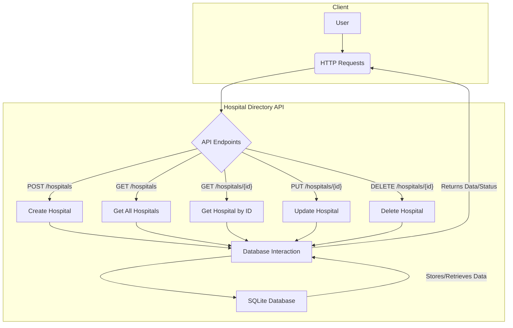

## Junior Backend Developer Take-Home Assignment: Hospital Directory API

### 1. Introduction

Welcome, prospective Junior Backend Developers! This take-home assignment is designed to assess your foundational backend development skills. It simulates a common real-world scenario: building a simple API. We're looking for clean code, logical thinking, and an understanding of core backend concepts.

**Estimated Completion Time:** 2-4 hours

### 2. Scenario: Simple Hospital Directory API

You are tasked with building a RESTful API for a basic Hospital Directory application. This API will allow users to manage hospital information, including adding, viewing, updating, and deleting hospital records.

### 3. Functional Requirements

Your API should support the following operations for hospitals:

- **Create Hospital:**
  - **Endpoint:** `POST /hospitals`
  - **Request Body:** JSON object with `name` (string, required), `address` (string, required), and `phone` (string, optional).
  - **Response:** The newly created hospital object, including a unique `id`.
- **Get All Hospitals:**
  - **Endpoint:** `GET /hospitals`
  - **Response:** A list of all hospital objects.
- **Get Hospital by ID:**
  - **Endpoint:** `GET /hospitals/{hospital_id}`
  - **Response:** The hospital object corresponding to `hospital_id`. Return a 404 if not found.
- **Update Hospital:**
  - **Endpoint:** `PUT /hospitals/{hospital_id}`
  - **Request Body:** JSON object with `name` (string, optional), `address` (string, optional), and `phone` (string, optional).
  - **Response:** The updated hospital object. Return a 404 if not found.
- **Delete Hospital:**
  - **Endpoint:** `DELETE /hospitals/{hospital_id}`
  - **Response:** A success message or status. Return a 404 if not found.

**Hospital Model:** Each hospital should have at least the following attributes:

- `id` (unique identifier, e.g., integer)
- `name` (string)
- `address` (string)
- `phone` (string, optional)
- `created_at` (timestamp, automatically set on creation)

### 4. Expected Tech Stack

- **Language:** Python 3.8+
- **Web Framework:** Flask (preferred for its minimalism)
- **Data Persistence:** SQLite (using Python's built-in `sqlite3` module or an ORM like SQLAlchemy/PeeWee for simplicity, though direct `sqlite3` is perfectly acceptable for this assignment). In-memory storage is also acceptable if you prefer to focus solely on API logic.

### 5. API Design Overview (Mermaid Diagram)

### 6. Optional Tasks (Bonus Points)

If you have extra time or want to showcase additional skills, consider implementing one or more of the following:

- **Unit Tests:** Write unit tests for your API endpoints or core logic using `unittest` or `pytest`.
- **Pagination:** Implement basic pagination for the `GET /hospitals` endpoint (e.g., `?page=1&limit=10`).
- **Dockerization:** Provide a `Dockerfile` and `docker-compose.yml` to easily run your application in a Docker container.
- **Basic Error Handling:** Implement more robust error handling for invalid input or server errors.

### 7. Evaluation Rubric / Checklist

Your submission will be evaluated based on the following criteria:

- **Functional Correctness (40%)**
  - All specified API endpoints work as described.
  - Correct HTTP status codes are returned (e.g., 200 OK, 201 Created, 404 Not Found).
  - Data persistence works correctly (hospitals are saved and retrieved).
- **Code Quality & Readability (30%)**
  - Clear, concise, and well-organized code.
  - Appropriate use of functions and modules.
  - Meaningful variable and function names.
  - Comments where necessary (but prefer self-documenting code).
  - Adherence to PEP 8 style guidelines.
- **API Design & REST Principles (20%)**
  - Adherence to RESTful principles (e.g., using appropriate HTTP methods, clear resource naming).
  - Sensible request/response structures.
- **Problem Solving & Approach (10%)**
  - Demonstrates understanding of the problem.
  - Logical implementation choices.
  - (For optional tasks) Ability to implement additional features cleanly.

### 8. Submission Instructions

Please submit your assignment as a Git repository (e.g., GitHub, GitLab, Bitbucket). The repository should include:

- All source code files.
- A `README.md` file with:
  - Instructions on how to set up and run your application.
  - Any assumptions you made.
  - A brief explanation of your design choices.
  - (Optional) How to run any tests you've written.

Good luck, and we look forward to reviewing your work!
